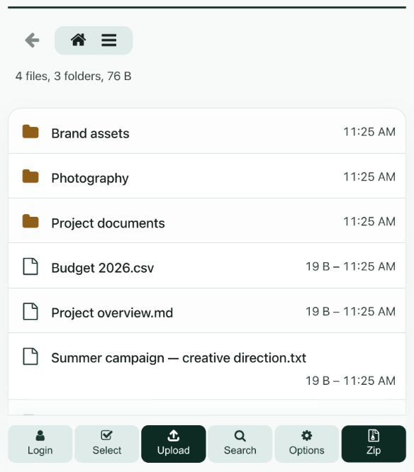
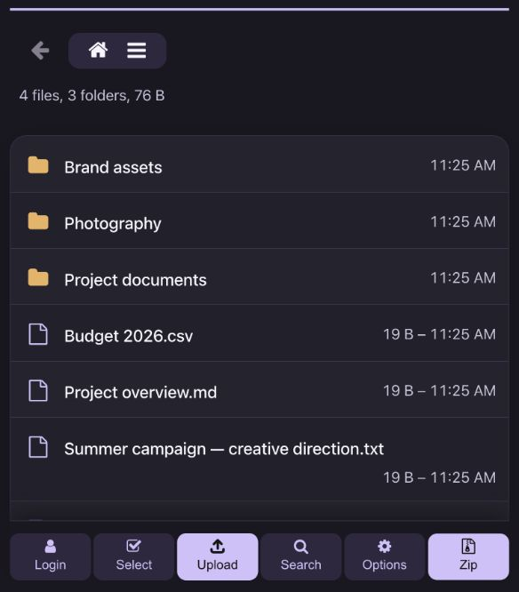

# Tide theme for HFS

A lightweight file browser with a **main color you can choose in the plugin's admin options**.
Green is just the default: choose another color and Tide adapts its surfaces, buttons, links and selection highlights for both light and dark mode.

| Green · light mode | Violet · dark mode |
| --- | --- |
|  |  |

Two configurations of the same theme. Both colors work in either mode.
The styling uses CSS and system fonts, with no dependencies or external requests. Forcing an appearance adds only a small inline assignment to HFS's native theme override.

- **Appearance** in the plugin's admin options defaults to **Automatic (visitor preference)**. Optionally choose **Force light** or **Force dark** for everyone. Reload the file browser after saving. Returning to Automatic restores the visitor's existing preference, or the system theme if none was chosen.
- Optional main color in Admin → Plugins → Tide → Options; defaults to sea green. Reload the file browser after saving. The chosen color seeds the palette: light/dark shades are adjusted for readable controls, and folder icons keep their gold color.
- Highlights the entire selected row, with an accent edge.
- Separates folder icons, filenames and metadata visually.
- Gives mobile toolbar buttons stacked labels and generous touch targets.
- Keeps native filtering, sorting, uploads, dialogs, keyboard navigation and tiles.
- Uses opaque surfaces instead of backdrop blur and respects reduced motion for its transitions.
- Toasts use subtle tinted backgrounds, with distinct success, warning and error colors independent of the main color.

Requires HFS 3.1 or later and a modern browser supporting CSS `:has()` and `color-mix()`.
The theme extends HFS's built-in styles; other plugins can still add content.
Third-party CSS customizations may need adjustment.

## Install

Copy `dist` to your HFS plugins directory as `tide-theme`, then enable it in Admin → Plugins.
HFS enables only one theme at a time.

For local development:

```sh
ln -s /absolute/path/hfs-tide-theme/dist ~/.hfs/plugins/tide-theme
```

All distributed files are in `dist`. No build step. MIT licensed.

## Verification

Tested on HFS 3.3.0-rc7 with Chromium at 1280, 673, 672, 601, 600, 390 and 320px, in light and dark mode.
The smoke check covers root/folder breadcrumbs, selection, filtering, dialogs, tiles, visible toolbar labels and horizontal overflow.
It also checks primary-button and toast text contrast with green, violet, yellow, white and black palette seeds in both modes.
It uses the existing Playwright installation in the sibling `hfs` checkout:

```sh
HFS_URL=http://127.0.0.1:8097/ node check.cjs
```

Use a disposable HFS instance with Tide enabled, at least two entries and a folder.
To check forced appearance and preservation of visitor preferences, run `HFS_CONFIG=/absolute/path/to/disposable/config.yaml node check-mode.cjs`. This temporarily changes that server's plugin setting and restores its configuration afterward.
Other browsers and third-party theme combinations have not been verified.
